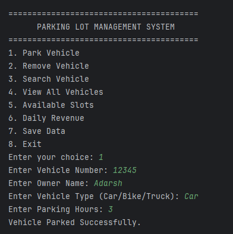
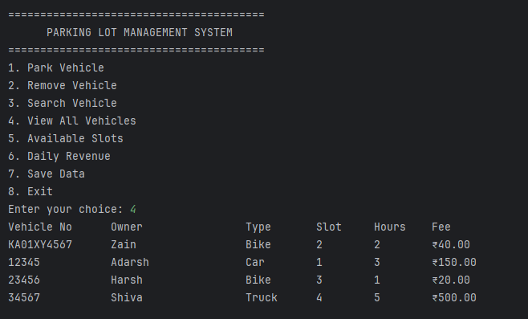
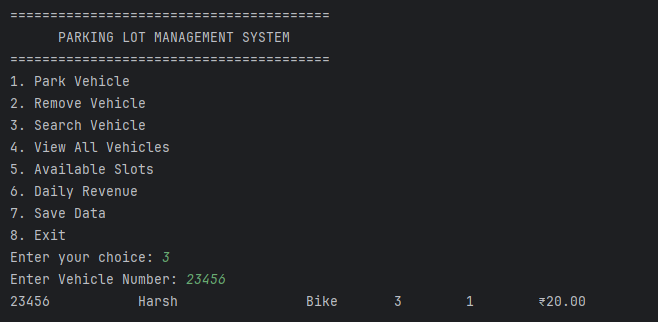
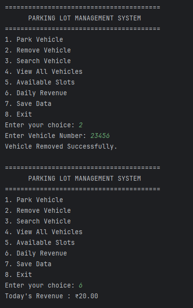

#  Parking Lot Management System

A console-based **Parking Lot Management System** developed using **Core Java**. The application manages vehicle entry and exit, automatically allocates parking slots, calculates parking fees based on vehicle type, and stores records using file handling. The project demonstrates **Object-Oriented Programming (OOP)** principles including **inheritance**, **polymorphism**, **abstraction**, and the **Java Collections Framework**.

---

##  Features

-  Vehicle Entry
-  Vehicle Exit
-  Search Vehicle by Vehicle Number
- ️Automatic Parking Slot Allocation
-  Parking Fee Calculation
-  Display All Parked Vehicles
-  Display Available Parking Slots
-  Daily Revenue Calculation
-  File Handling using BufferedReader & BufferedWriter
- ️Exception Handling and Input Validation

---

##  Technologies Used

- Java
- Object-Oriented Programming (OOP)
- Inheritance
- Polymorphism
- Abstraction
- Java Collections Framework (ArrayList)
- File Handling
- Exception Handling
- IntelliJ IDEA


---

##  How to Run

1. Clone the repository

```bash
git clone https://github.com/Adarsh-26-dot/Parking-Lot-Management-System.git
```

2. Open the project in **IntelliJ IDEA**

3. Run **Main.java**

4. Use the console menu to manage the parking lot.

---

##  Screenshots

### Main Menu



### Park Vehicle



### Search Vehicle



### Daily Revenue



---

##  Object-Oriented Design

### Inheritance

```
Vehicle
   │
   ├── Car
   ├── Bike
   └── Truck
```

### Polymorphism

Each subclass overrides the following methods:

- `calculateParkingFee()`
- `getVehicleType()`

The project stores all vehicles using:

```java
ArrayList<Vehicle> vehicles = new ArrayList<>();
```

This enables runtime polymorphism while calculating parking fees.

---

##  Parking Fee Structure

| Vehicle Type | Parking Fee |
|--------------|------------:|
| Bike | ₹20/hour |
| Car | ₹50/hour |
| Truck | ₹100/hour |

---

##  Future Enhancements

- Multi-floor parking support
- Admin login system
- Parking history
- Vehicle update functionality
- Database integration (MySQL)
- GUI using JavaFX or Swing
- QR Code based entry & exit
- Online parking reservation

---

##  Author

**Shiva Adarsh**

